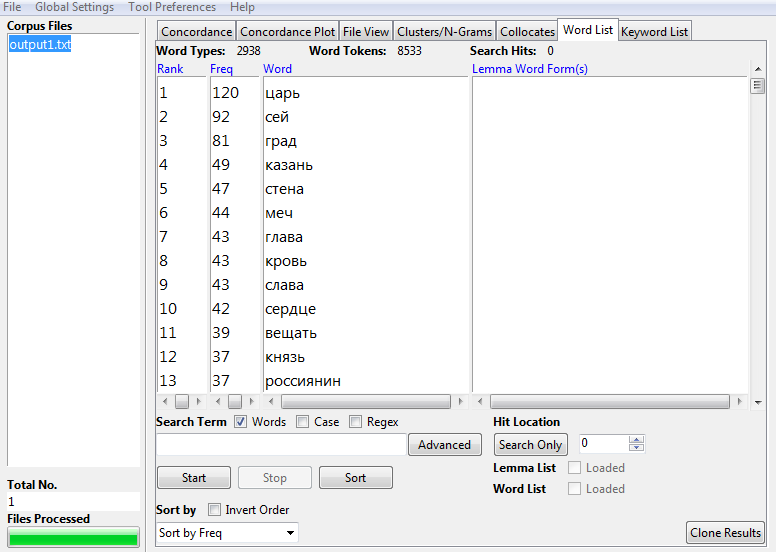

# 
Задание 1

Стоп-слова 

Устаревшее слово 1 

Устаревшее слово 2 

Устаревшее слово 3 

Н-граммы 

Коллокации 

Задание 2

Чертоги 

"Чертоги" употребляется наравне с "дворцом" в 1700-е, но потом употребление слова постпенно сходит к минимальным показателям, тогда как "дворец" даже в моменты редкого употребления используется так же часто, как "чертоги" в пик своей активности. НКРЯ
и гугл н-граммы на удивление практически идентичны в своих показателях.

ipm=1,13

Колико 
 
"Сколько" всегда было общеупотребимее "колико", но последнее всё же используется на протяжении восемндацатого века, хотя НКРЯ и гугл н-граммы здесь расходятся в показателях. Согласно первому, слово употреблялось в первой половине века, постепенно выходя из узуса ко второй половине. Второй корпус же представляет обратную ситуацию частой употребимости слова во второй половине восемнадцатого века. Так, относительно небольшое количество ранних источников в базе данных корпусов пока что мешает чистоте исследования -- не вполне ясно, к какому из корпусов обращаться.
 
ipm=1,77

Петиметр 

"Петиметр" в НКРЯ представлен в использовании почти исключительно в восемнадцатом веке, тогда как гугл н-граммы показывают его столь же часто употребимым в 1950-е. "Щёголь" как его не слишком употребимый, но всё же достаточно современный аналог появляется в корпусе в одно время с "петиметром", но используется в десять раз чаще.

ipm=0,11

Задание 3

Корпусное исследование даёт точное представление об употребимости слов на момент написания произведения. Так, слово "петиметр" было малоупотребимым и во времена Богдановича и его "Душеньки". Такие вещи легко упустить без корпуса, потому что сегодня мы уже не чувствуем эти изменения в языке так тонко -- слова зачастую представляются нам одинаково устаревшими без градации и колебаний в употреблении на протяжении нескольких веков. Корпус позволяет находить разницу в употреблении таких слов в прошлом для Богдановича, а не для нас. Подобно тому, как мы должны забыть обо всём написанном после Мандельштама, чтобы анализировать его стихи, корпус даёт забыть о нашем -- не всегда верном -- представлении о слове и представляет его количественно точно,без замутнённого взгляда отдельного человека.

